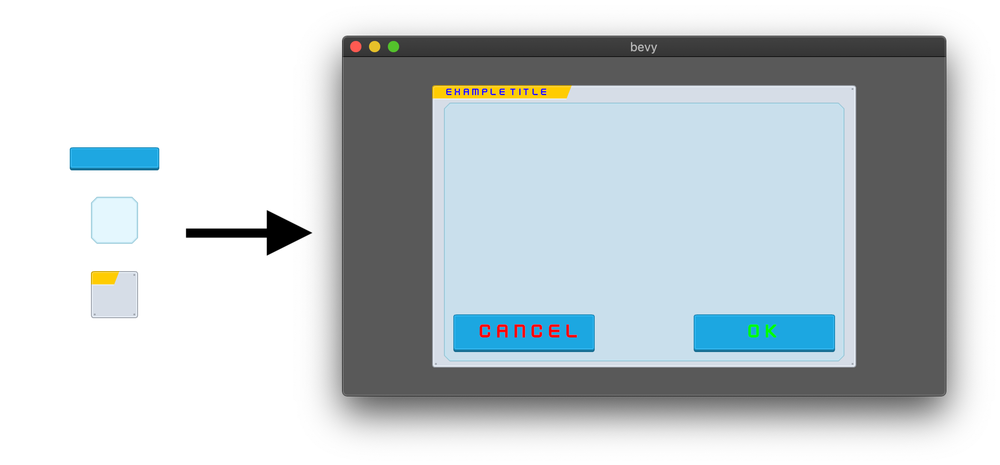

# Bevy 9-Patch plugin


[](https://docs.rs/bevy_ninepatch)
[](https://crates.io/crates/bevy_ninepatch)
[](https://github.com/bevyengine/bevy/blob/main/docs/plugins_guidelines.md#main-branch-tracking)
[](https://github.com/vleue/bevy_ninepatch/actions/workflows/ci.yaml)

Implementation of 9-patch images in Bevy. Let you have a UI that scale only the right parts of your images.



See [the examples](https://github.com/vleue/bevy_ninepatch/tree/main/examples) for what can be done.

## Simple usage

After adding the `NinePatchPlugin` plugin, spawning an `Entity` with the `NinePatchBundle` component bundle will add a 9-patch UI element.

A simple builder based on Godot's [NinePatchRect](https://docs.godotengine.org/en/3.2/classes/class_ninepatchrect.html) is available.

```rust
use bevy::prelude::*;
use bevy_ninepatch::*;

fn setup(
    mut commands: Commands,
    asset_server: Res<AssetServer>,
    mut nine_patches: ResMut<Assets<NinePatchBuilder<()>>>,
) {
    // Texture for the base image
    let panel_texture_handle = asset_server.load("assets/glassPanel_corners.png");

    // Create a basic 9-Patch UI element with margins of 20 pixels
    let nine_patch_handle = nine_patches.add(NinePatchBuilder::by_margins(20, 20, 20, 20));

    // This entity will be placed in the center of the 9-Patch UI element
    let content_entity = commands.spawn_bundle(TextBundle { ..Default::default() }).id();

    commands.spawn_bundle(
        NinePatchBundle {
            style: Style {
                margin: Rect::all(Val::Auto),
                justify_content: JustifyContent::Center,
                align_items: AlignItems::Center,
                size: Size::new(Val::Px(500.), Val::Px(300.)),
                ..Default::default()
            },
            nine_patch_data: NinePatchData::with_single_content(
                panel_texture_handle,
                nine_patch_handle,
                content_entity,
            ),
            ..Default::default()
        },
    );
}
```

See [plugin.rs example](https://github.com/vleue/bevy_ninepatch/blob/main/examples/plugin.rs) for a complete example.

## Changing element size

The component `Style` can be changed to update the size of the 9-Patch UI element, by changing the `size` attribute.

See [change_size.rs example](https://github.com/vleue/bevy_ninepatch/blob/main/examples/change_size.rs) for a complete example.

## Specify content to use

You can specify the content to be used inside the 9-Patch UI element. When creating a 9-Patch by specifying the margins, a content zone will be available by default for the center of the 9-Patch UI element. This can be set with the `NinePatchContent` component.

See [multi_content.rs example](https://github.com/vleue/bevy_ninepatch/blob/main/examples/content.rs) for a complete example.

## More flexible definition

It is possible to set any number of patches for an image, the only constraints is that all patches in a line must have the same height. Using this methods, different parts of the image can grow at different rates, and several content zones can be created.

See [full.rs example](https://github.com/vleue/bevy_ninepatch/blob/main/examples/full.rs) for a complete example.

## Bevy Compatibility

|Bevy|bevy_ninepatch|
|---|---|
|main|main|
|0.6|0.6|
|0.5|0.5|
